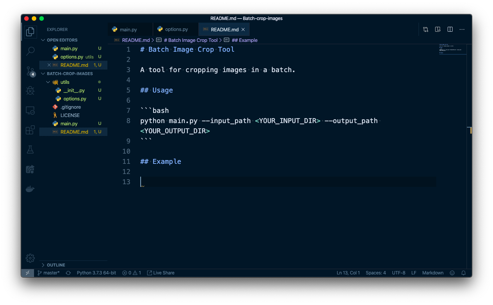
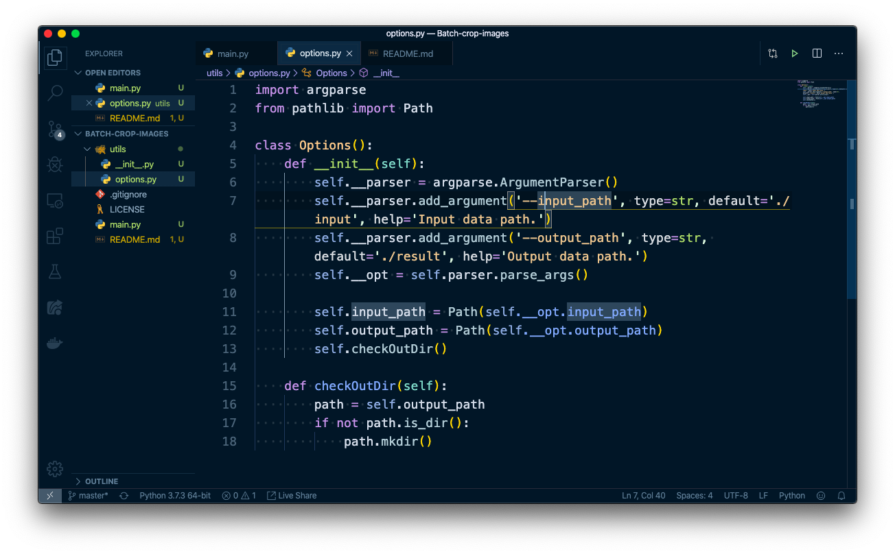
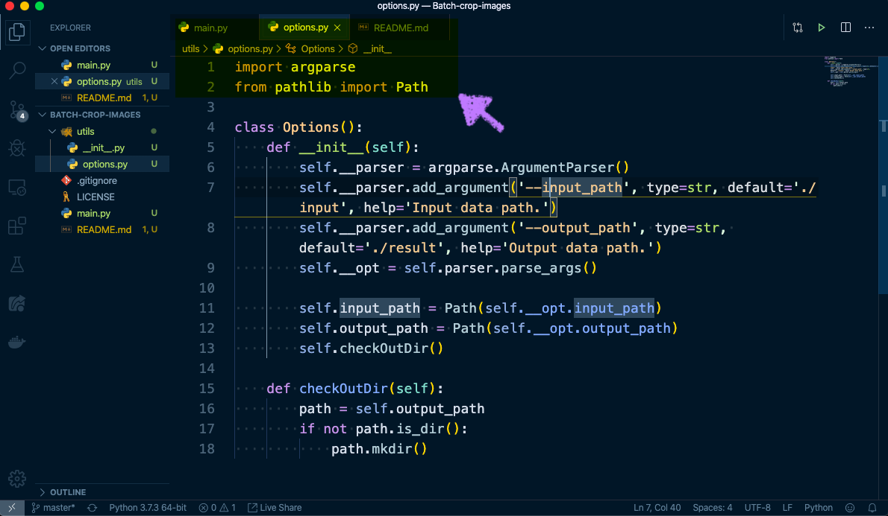
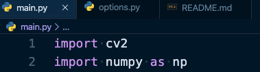
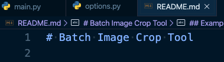
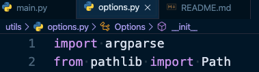

# Batch Image Crop Tool

A tool for cropping images in a batch with an interface.

## Requirement

- numpy
- opencv-python
- tqdm

## Usage

```bash
python main.py --input_path <YOUR_INPUT_DIR> --output_path <YOUR_OUTPUT_DIR>
```

## Example

* Test images which need to be cropped






* Processing with mouse



* Cropped result






